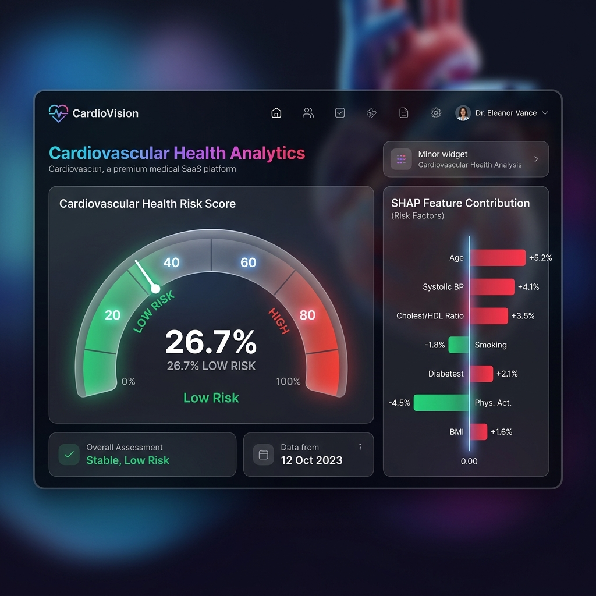
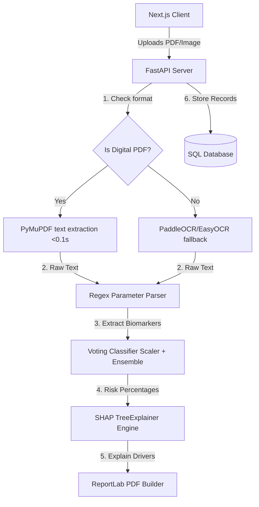

# CardioVision 🫀

### **Heart Report Analysis & Cardiovascular Risk Assessment**

CardioVision is a production-ready AI healthcare SaaS platform designed to analyze cardiac reports (PDF/images), perform OCR parameter extraction, compute heart health risks using an XGBoost + LightGBM ensemble model, explain predictions via SHAP, and compile personalized, actionable health guidelines into downloadable PDF reports.

[](https://cardiovision-web.onrender.com)
[](https://opensource.org/licenses/MIT)

---

## 📸 Dashboard Preview



---

## ✨ Features

- **Guest-First Session Workflow**: Users can upload reports, analyze data, and download clinical PDF summaries instantly **without creating an account**. Registered users unlock full history tracking, dashboard analytics, and risk trend charting.
- **Ultra-Fast Hybrid Extraction Engine**: 
  - *Digital PDF Extraction (PyMuPDF)*: Bypasses OCR for digital PDF reports, extracting structured text in **<0.1 seconds** with **100% accuracy**.
  - *OCR Fallback (PaddleOCR / EasyOCR)*: Automatically preprocesses scanned documents/images using OpenCV (CLAHE contrast adjustment, denoising) and runs neural text scanning when text streams aren't embedded.
- **Explainable AI Pipeline**:
  - Predicts cardiovascular risk using a **soft-voting ensemble** (XGBoost + LightGBM).
  - Computes SHAP (SHapley Additive exPlanations) values to detail exactly how much each biomarker contributed to the patient's individual risk.
  - Models 5 specific sub-conditions: Coronary Artery Disease, Hypertension, Heart Failure, Arrhythmia, and Atherosclerosis.
- **Actionable Health Pillars**: Custom rule-based expert system mapping pathological values directly to recommendations across five medical fields: Diet, Exercise, Lifestyle, Clinical Follow-up, and Weekly Monitoring.
- **ReportLab PDF Exporter**: Streams beautifully designed clinical PDF reports summarizing biomarkers, risk breakdowns, and lifestyle advice.

---

## 🛠️ Tech Stack

| Layer | Technologies |
|-------|--------------|
| **Frontend** | Next.js 15, TypeScript, Tailwind CSS, Framer Motion, Recharts, Zustand |
| **Backend** | FastAPI, SQLAlchemy, SQLite (local) / PostgreSQL (production), JWT |
| **ML Engine** | XGBoost, LightGBM, SHAP, Scikit-Learn |
| **OCR & Text** | PyMuPDF (fitz), pdf2image, OpenCV |
| **Cloud Storage** | Supabase Storage Bucket |

---

## 📐 Architecture Diagram



---

## 🚀 Quick Start

### 1. Pre-requisites & Setup
Ensure you have Python 3.10+ installed.

```bash
# Clone the repository
git clone https://github.com/samarthupadhyay2294-rgb/CardioVision.git
cd CardioVision/cardiovision
```

### 2. Configure Environment
Create a `.env` file in the `cardiovision` folder:
```env
APP_NAME="CardioVision API"
DATABASE_URL="sqlite:///./data/cardiovision.db"
SECRET_KEY="your-jwt-signing-secret"
CORS_ORIGINS="http://localhost:3000"
```

### 3. Run Backend API
```bash
# Install dependencies
pip install -r backend/requirements.txt

# Retrain model (if needed)
python scripts/train_model.py

# Launch FastAPI server
uvicorn backend.main:app --reload --port 8000
```
Open [http://localhost:8000/docs](http://localhost:8000/docs) to view the API documentation.

### 4. Run Frontend Client
```bash
cd ../cardiovision/frontend

# Copy variables
cp .env.local.example .env.local

# Install & Run
npm install
npm run dev
```
Open [http://localhost:3000](http://localhost:3000) to view the application dashboard.

---

## ⚕️ Medical Disclaimer

CardioVision is an AI-powered cardiovascular risk assessment utility. It is **not** a diagnostic tool and does not replace professional medical advice, consultation, or treatment. Always discuss report findings with a certified cardiologist or physician.

---

## 📄 License

Distributed under the MIT License. See `LICENSE` for details.
